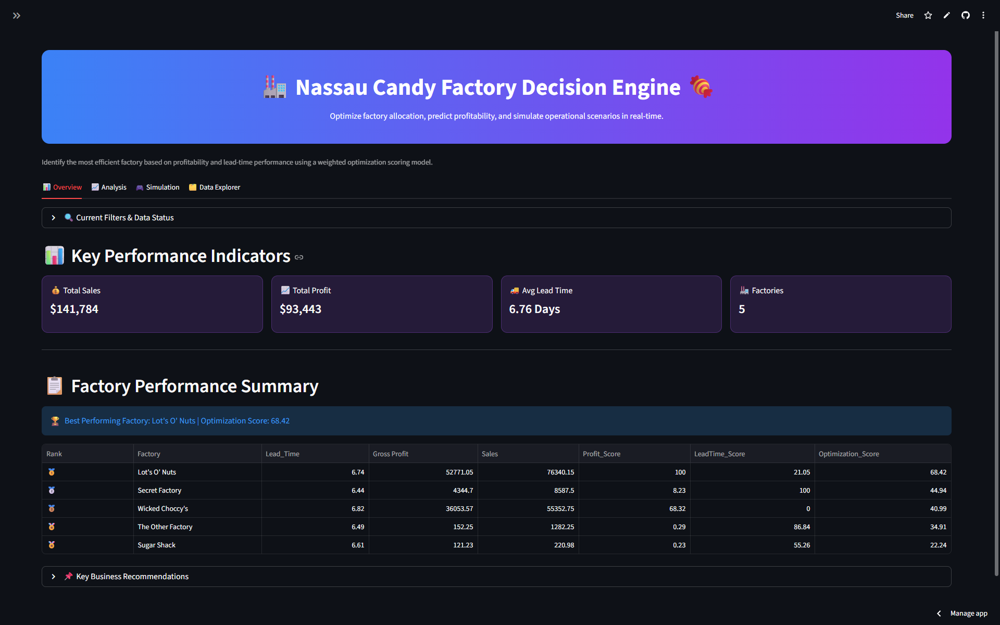
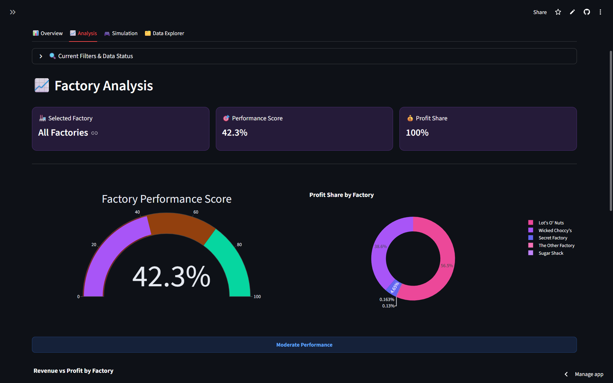
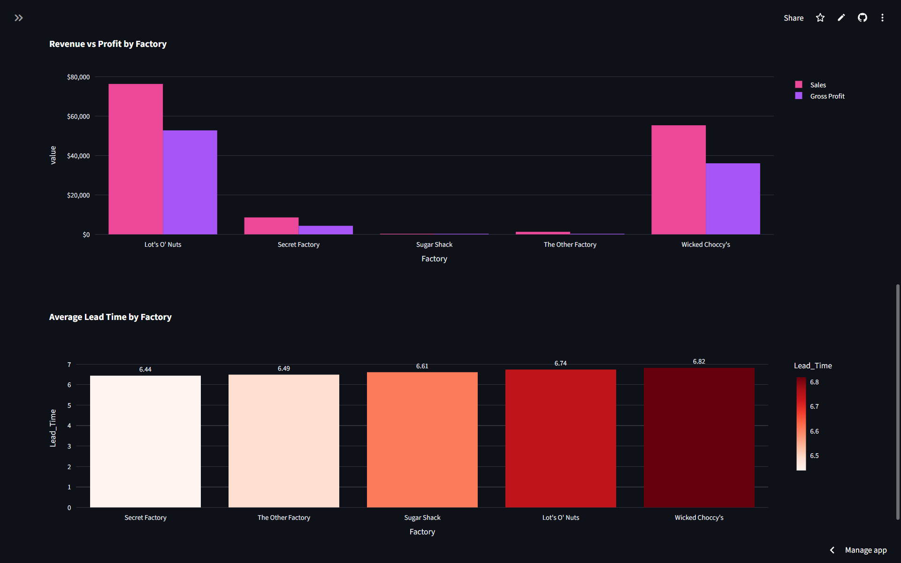
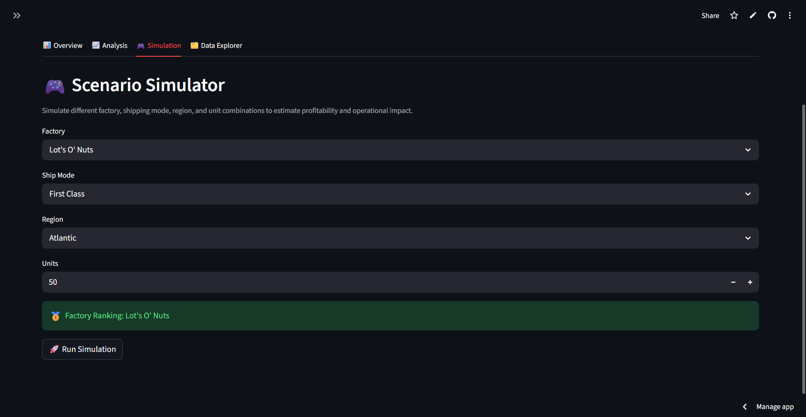
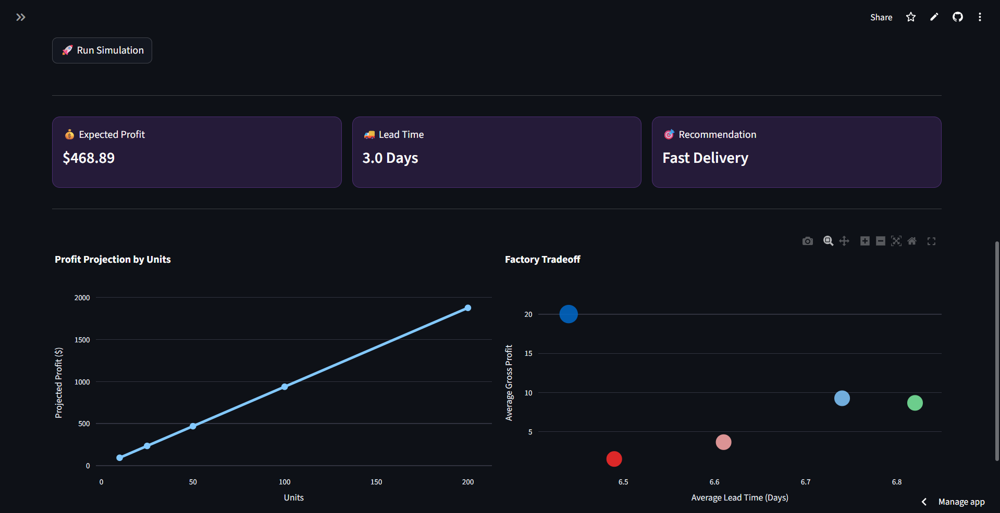
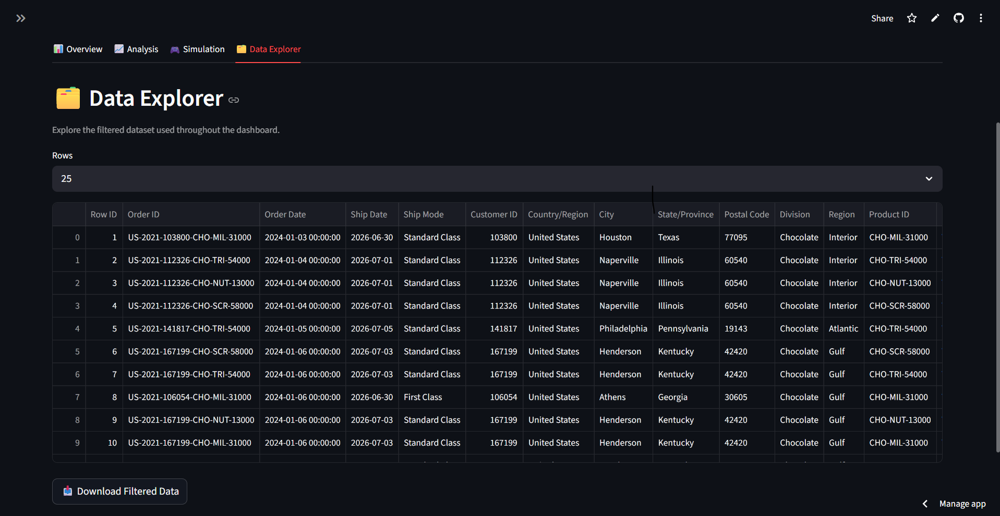
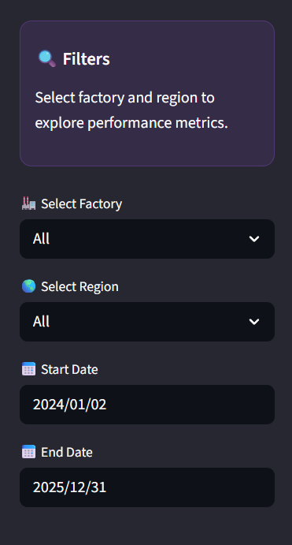

<div align="center">

# 🏭 Factory Optimization Decision Engine

### Interactive Streamlit Dashboard for Factory Performance Analysis, Profitability Optimization & Operational Decision Support

<p>
An end-to-end data analytics project that transforms raw operational data into actionable business insights through KPI dashboards, optimization scoring, interactive visualizations, and scenario simulation.
</p>

---


</div>

---

# 📌 Project Overview

This project analyzes factory performance using operational and financial metrics to help businesses identify the most efficient manufacturing facilities.

The dashboard combines profitability, lead time, and operational efficiency into a weighted optimization model, enabling decision-makers to compare factories, identify improvement opportunities, and simulate business scenarios.

Unlike traditional dashboards that only visualize KPIs, this application provides business recommendations based on calculated optimization scores.

---

# 🎯 Business Objective

The dashboard helps answer questions such as:

- Which factory performs best overall?
- Which factory contributes the highest profit?
- Which factory has the lowest operational efficiency?
- How does lead time affect profitability?
- Which factories should management prioritize for improvement?
- How would different operational scenarios affect performance?

---

# ✨ Features

## 📊 Dashboard Overview

- Executive KPI cards
- Factory performance ranking
- Optimization Score calculation
- Best performing factory identification
- Business recommendations

---

## 📈 Factory Analysis

Interactive visualizations including:

- Performance Gauge
- Profit Share Analysis
- Revenue vs Profit Comparison
- Average Lead Time Analysis

---

## 🎮 Scenario Simulator

Users can simulate operational conditions by selecting:

- Factory
- Shipping Mode
- Region
- Units

The dashboard estimates profitability while providing operational recommendations.

---

## 📂 Data Explorer

- Interactive filtered dataset
- Adjustable row preview
- CSV download functionality

---

# 🧠 Optimization Methodology

Each factory is evaluated using a weighted optimization score calculated from two business metrics.

### Profit Score

Factories with higher gross profit receive higher scores.

### Lead Time Score

Factories with lower lead times receive higher scores.

### Final Optimization Score

```
Optimization Score

=

(Profit Score × 70%)

+

(Lead Time Score × 30%)
```

Factories are ranked according to this weighted score.

---

# 📈 Key KPIs

The dashboard calculates:

- Total Sales
- Total Gross Profit
- Average Lead Time
- Factory Count
- Factory Ranking
- Profit Share
- Performance Score

---

# 📊 Dashboard Workflow

```
Raw Dataset
      │
      ▼
Data Cleaning
      │
      ▼
Feature Engineering
      │
      ▼
Aggregation by Factory
      │
      ▼
Profit & Lead Time Scoring
      │
      ▼
Optimization Score
      │
      ▼
Interactive Dashboard
      │
      ▼
Business Recommendations
```

---

# 💼 Business Insights

The dashboard enables businesses to:

- Identify top-performing factories
- Detect operational bottlenecks
- Compare profitability across facilities
- Monitor lead-time efficiency
- Support operational decision-making
- Prioritize resource allocation
- Improve supply chain performance

---

# 🛠 Tech Stack

| Category | Technologies |
|-----------|-------------|
| Language | Python |
| Dashboard | Streamlit |
| Data Processing | Pandas, NumPy |
| Visualization | Plotly |
| Machine Learning | Scikit-Learn |
| Statistical Analysis | Statsmodels |
| Excel Support | OpenPyXL |

---

# 📁 Project Structure

```text
factory-optimization-decision-engine/
│
├── App/
│   └── factory_decision_engine.py
│
├── Data/
│   ├── Nassau Candy Distributor.csv
│   └── Processed_nassau_candy_data.csv
│
├── Screenshots/
│
├── Notebooks/
│   ├── factory_optimization.ipynb
│   ├── modeling.ipynb
│   └── simulation_engine.ipynb
│
├── requirements.txt
├── README.md
└── LICENSE
```

---

# 🚀 Installation

Clone the repository

```bash
git clone https://github.com/yourusername/factory-optimization-decision-engine.git
```

Move into the project

```bash
cd factory-optimization-decision-engine
```

Install dependencies

```bash
pip install -r requirements.txt
```

Run the dashboard

```bash
streamlit run App/factory_decision_engine.py
```

---

# 📸 Dashboard Preview

## Dashboard Overview

> 

```
screenshots/overview.png
```

---

## Factory Analysis

> 
> 

```
screenshots/analysis.png
```

---

## Scenario Simulator

> 
> 

```
screenshots/simulation.png
```

---

## Data Explorer

> 

```
screenshots/Data_explorer.png
```

---

## Filters

> 

```
screenshots/filters.png
```

---

# 📌 Future Improvements

- Predictive demand forecasting
- Inventory optimization
- Factory clustering
- Route optimization
- Production forecasting
- What-if analysis with machine learning
- Cost optimization module
- Deployment with cloud database integration

---

# 👨‍💻 Author

**Shantanu Kamble**

Data Analytics | Data Science | Machine Learning

GitHub:
https://github.com/shan-k204

LinkedIn:
www.linkedin.com/in/shantanu-kamble-64a21929a

---

# ⭐ Support

If you found this project useful, consider giving it a ⭐ on GitHub.

It helps others discover the project and motivates future improvements.
